# T-Air: Telegram Air Quality Network

## Problem Statement
Kualitas udara di kota-kota besar Indonesia sangat buruk, namun data pemantauan resmi sangat terbatas (hanya ada di titik tertentu) dan mahal. Masyarakat tidak memiliki akses data real-time yang spesifik di lokasi rumah mereka (hyperlocal).

## Solusi
T-Air adalah jaringan DePIN berbasis komunitas yang memanfaatkan sensor murah (ESP32) dan Telegram untuk memantau kualitas udara. Kami menghilangkan hambatan teknis dengan mengintegrasikan seluruh pengalaman pengguna (monitoring & wallet) langsung di dalam Telegram Mini App, didukung oleh blockchain TON untuk insentif transparan.

## Arsitektur Sederhana

```mermaid
graph TD
    %% Styling
    classDef hardware fill:#f96,stroke:#333,stroke-width:2px;
    classDef server fill:#61dafb,stroke:#333,stroke-width:2px;
    classDef blockchain fill:#0098ea,stroke:#333,stroke-width:2px,color:white;

    subgraph "1. Device Layer (DeIoT)"
        A["📡 ESP32 + MQ-135"]:::hardware
    end

    subgraph "2. Bridge Layer (Backend)"
        B("☁️ Vercel Serverless API"):::server
        C[("🗄️ MongoDB Atlas")]:::server
    end

    subgraph "3. User Interface Layer"
        D["📱 Telegram Mini App"]:::server
        U["👤 User / Warga"]
    end

    subgraph "4. Blockchain Layer (TON)"
        E["💎 Smart Contract (Tact)"]:::blockchain
        F["💰 User Wallet (Tonkeeper)"]:::blockchain
    end

    %% Alur Data
    A -->|1. Kirim Data Kualitas Udara| B
    B -->|2. Validasi & Simpan Log| C
    U -->|3. Buka Dashboard & Monitoring| D
    D -->|4. Request Data Real-time| B
    D -->|5. Klik 'Claim Reward'| E
    E -->|6. Distribusi Token $TAIR| F
```

### Penjelasan Singkat Alur Diagram:

1.  **Device Layer:** Sensor ESP32 membaca polusi dan mengirim data mentah ke cloud.
2.  **Bridge Layer:** Vercel menerima data, memastikan data valid (bukan spam), lalu menyimpannya di MongoDB agar akses cepat dan murah.
3.  **UI Layer:** Pengguna melihat grafik udara lewat Telegram Mini App yang mengambil data dari Vercel.
4.  **Blockchain Layer:** Saat pengguna mengklaim reward, Mini App berinteraksi dengan **Smart Contract TON** untuk mengirim token ke Wallet pengguna.

## Komponen DePIN & TON

**DeIoT**: Penggunaan sensor fisik terdesentralisasi.

**TON Integration**: Smart Contract menggunakan bahasa Tact, Wallet menggunakan Tonkeeper, UI menggunakan Telegram Mini App.

## Next Steps

- Menambahkan validasi "Proof of Location" menggunakan GPS module
- Marketplace data udara terdesentralisasi untuk peneliti  
- Integrasi notifikasi peringatan dini bencana asap

## Tech Stack
- **Frontend**: React + Telegram Mini App SDK
- **Backend**: Node.js + Express (Vercel Serverless)
- **Database**: MongoDB Atlas
- **Blockchain**: TON (Tact Language)
- **Hardware**: ESP32 + MQ-135 Sensor

## Value Proposition
1. **Hyperlocal Data**: Data kualitas udara spesifik per lokasi
2. **Community Driven**: Dioperasikan oleh komunitas, bukan korporasi
3. **Incentivized**: Pengguna mendapat reward TON untuk kontribusi data
4. **Easy Access**: Semua fitur terintegrasi dalam Telegram
5. **Low Cost**: Menggunakan sensor murah dan infrastruktur existing