# T-Air: Advanced Air Quality Monitoring DePIN

## 🌬️ Deskripsi Singkat
T-Air mengubah sensor MQ-135 menjadi stasiun monitoring kualitas udara yang canggih. Mendeteksi CO, NH3, Alkohol, Asap dengan dashboard real-time dan reward TON blockchain.

## 📊 Kategori DePIN
DeIoT / Sensors

## 🚀 5 Langkah Menjalankan (Local Development)

### 1. Clone Repo:
```bash
git clone https://github.com/pratama404/tair.git
cd t-air-clean
```

### 2. Install Dependencies:
```bash
# Backend
cd backend && npm install

# Frontend  
cd ../frontend && npm install
```

### 3. Konfigurasi Environment:
- Copy `backend/.env.example` ke `backend/.env`
- Isi variabel environment:
  - `MONGODB_URI`: Connection string dari MongoDB Atlas
  - `BOT_TOKEN`: Token bot dari BotFather Telegram
  - `MNEMONIC`: Mnemonic phrase wallet TON admin

**⚠️ PENTING: Jangan commit file .env ke GitHub!**

### 4. Jalankan Aplikasi:
```bash
# Terminal 1 (Backend)
cd backend && npm run dev

# Terminal 2 (Frontend)
cd frontend && npm run dev
```

### 5. Buka Browser/Telegram:
- Web Admin: `http://localhost:5173`
- Telegram Bot: Setup webhook ke backend URL

## 🏗️ Arsitektur & Tech Stack

### Backend
- **Framework**: Node.js (Serverless Functions)
- **Database**: MongoDB Atlas
- **Deployment**: Vercel
- **Blockchain**: TON SDK

### Frontend
- **Framework**: React + Vite
- **UI**: Telegram Mini App SDK
- **Styling**: CSS dengan Telegram theme variables

### Smart Contract
- **Language**: Tact
- **Network**: TON Testnet
- **Function**: Reward distribution

### Hardware
- **Platform**: ESP32
- **Sensor**: MQ-135 (Air Quality)
- **Communication**: HTTPS/JSON

### 🏗️ Arsitektur Sistem (Hybrid DePIN)

Sistem T-Air menggunakan pendekatan **Hybrid (Off-chain + On-chain)** untuk efisiensi biaya dan kecepatan data real-time.

1.  **Off-chain Layer (Data & IoT):**
    * **Perangkat:** Sensor ESP32 mengirim data kualitas udara setiap 5 menit via HTTPS.
    * **Backend:** Serverless API (Vercel) memvalidasi data dan menyimpannya di database MongoDB.
    * **Telegram UI:** Bot Telegram menampilkan data real-time kepada pengguna.

2.  **On-chain Layer (Incentive & Trust):**
    * **Settlement:** Poin yang terkumpul di database dikonversi menjadi Token $TAIR di jaringan **TON Blockchain**.
    * **Smart Contract:** Mencatat transaksi reward dan kepemilikan sensor secara transparan.

## 🏗️ Arsitektur Sistem

Berikut adalah alur data hybrid (Off-chain dan On-chain) yang digunakan dalam T-Air:

```mermaid
flowchart TD
    subgraph "OFF-CHAIN (IoT & Server)"
        A[📡 ESP32 Sensor] -->|1. Kirim Data/JSON| B(⚡ Vercel Backend)
        B -->|2. Validasi & Simpan| C[(🗄️ MongoDB Atlas)]
        D[📱 User Telegram] -->|3. Lihat Dashboard| B
    end

    subgraph "ON-CHAIN (TON Network)"
        D -->|4. Klik 'Claim Reward'| E{💎 Smart Contract}
        E -->|5. Mint Token $TAIR| F[💰 User Wallet]
    end
```



**Alur Data:**
`Sensor (ESP32)` ➡️ `Vercel API` ➡️ `MongoDB` ➡️ `User Claim` ➡️ `TON Blockchain`

## 📁 Struktur Project
```
t-air-clean/
├── backend/                  # Vercel API Backend
│   ├── api/
│   │   └── index.js          # Main serverless function
│   ├── .env                  # Environment variables
│   ├── .env.example          # Environment template
│   ├── package.json          # Backend dependencies
│   └── vercel.json           # Vercel config
├── frontend/                 # React Telegram Mini App
│   ├── src/
│   │   ├── App.jsx           # Main component
│   │   ├── App.css           # Styles
│   │   ├── index.css         # Global styles
│   │   └── main.jsx          # Entry point
│   ├── index.html            # HTML template
│   ├── package.json          # Frontend dependencies
│   └── vite.config.js        # Vite config
├── contract/                 # TON Smart Contract
│   └── contracts/
│       └── air_rewards.tact  # Tact contract
├── firmware/                 # ESP32 Code
│   └── sensor.ino            # Arduino code
├── README.md                 # This file
├── ONEPAGER.md              # Hackathon submission
└── .gitignore               # Git ignore rules
```

## 🔌 API Endpoints

### GET /api
Health check endpoint

### POST /api/submit
Submit enhanced sensor data
```json
{
  "sensorId": "MQ135_01",
  "aqi": 75,
  "co": 12,
  "smoke": 180,
  "nh3": 8,
  "alcohol": 15,
  "timestamp": "2025-01-12T15:30:42Z"
}
```

### GET /api/user?telegramId=123
Get user data and points

### POST /api/claim
Claim TON rewards
```json
{
  "telegramId": 123456789
}
```

### POST /api/connect-sensor
Connect sensor to user account
```json
{
  "telegramId": 123456789,
  "sensorId": "ESP32_01"
}
```

## 🚀 Deployment

### Backend (Vercel)
```bash
cd backend
vercel --prod
```

### Frontend (Vercel)
```bash
cd frontend
npm run build
vercel --prod
```

### Environment Variables di Vercel
Set di Vercel Dashboard:
- `MONGODB_URI`
- `BOT_TOKEN` 
- `MNEMONIC`

## 🔗 Production URLs
- **Backend API:** https://backend-r1t9va2ni-pratamas-projects.vercel.app
- **Frontend App:** https://frontend-oss0egm96-pratamas-projects.vercel.app
- **Smart Contract:** EQD4FPq-PRDieyQKkizFTRtSDyucUIqrj0v_zXJmqaDp6_0t (TON Testnet)
- **Telegram Bot:** @TonairBot

## 🎆 New Features (T-Air v2.0)
- **Enhanced MQ-135 Monitoring:** CO, NH3, Alcohol, Smoke detection
- **Real-time Dashboard:** Live charts with glassmorphism design
- **Smart Alerts:** Automatic warnings for dangerous gas levels
- **TON Wallet Integration:** Direct testnet wallet connection
- **Mobile-first UI:** Responsive design with smooth animations
- **Advanced Analytics:** Historical data tracking and trends

## 🧪 Testing

### Backend API Testing
```bash
node test-complete.js
```

### Smart Contract Testing
```bash
node test-smart-contract.js
```

## 🔧 Hardware Setup

### ESP32 Wiring
- MQ-135 VCC → 3.3V
- MQ-135 GND → GND  
- MQ-135 AOUT → GPIO 34

### Configuration
1. Update WiFi credentials di `firmware/sensor.ino`
2. Update server URL ke Vercel deployment
3. Flash firmware ke ESP32

## 👥 Tim
- [Ageng Putra Pratama] - Fullstack 

## 📄 License
MIT

## 🏆 Hackathon
PinGo Indonesian DePIN Hackathon 2025 - TON Track & DePIN Build Track